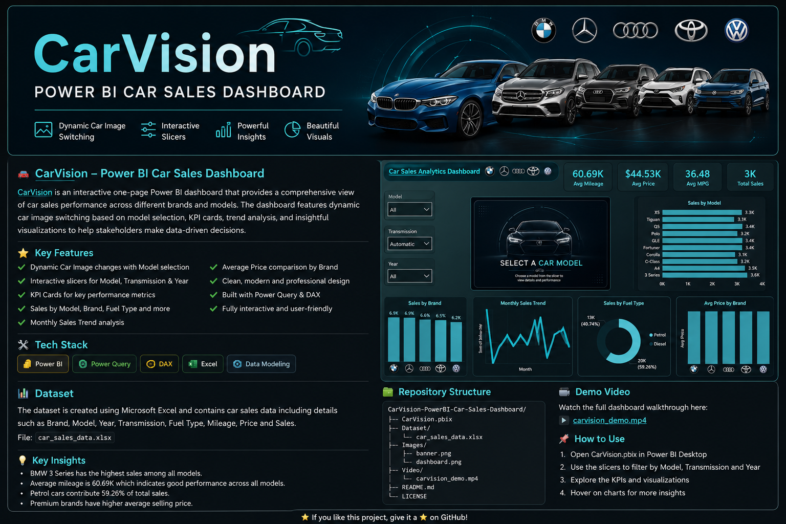
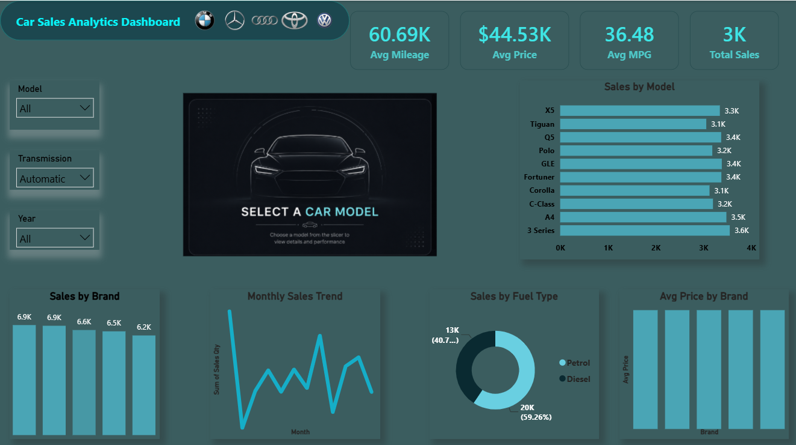

<div align="center">

# 🚗 CarVision – Power BI Car Sales Dashboard



### Interactive Car Sales Analytics Dashboard built using Power BI, Excel, Power Query & DAX

An interactive one-page Business Intelligence dashboard designed to analyze car sales performance across multiple brands and models using dynamic visuals, KPI cards, and image-based interactivity.


</div>

---

# 📌 Project Overview

CarVision is an interactive Power BI dashboard that provides a comprehensive overview of car sales performance across different brands and models.

The dashboard features dynamic car image switching based on model selection, KPI cards, trend analysis, and interactive visualizations to help users analyze sales performance efficiently.

---

# ✨ Key Features

- 🚗 Dynamic car image changes based on selected model
- 📊 Interactive slicers for Model, Transmission, and Year
- 📈 KPI Cards
  - Average Mileage
  - Average Price
  - Average MPG
  - Total Sales
- 📅 Monthly Sales Trend
- 🏷 Sales by Brand
- 🚙 Sales by Model
- ⛽ Sales by Fuel Type
- 💰 Average Price by Brand
- 🎯 Fully Interactive Dashboard

---

# 📷 Dashboard Preview



---

# 📊 Dashboard KPIs

| KPI | Description |
|------|-------------|
| Average Mileage | Average mileage of sold vehicles |
| Average Price | Average selling price |
| Average MPG | Average fuel efficiency |
| Total Sales | Total number of vehicles sold |

---

# 📈 Dashboard Visualizations

- Sales by Brand
- Sales by Model
- Monthly Sales Trend
- Sales by Fuel Type
- Average Price by Brand
- Dynamic Car Image
- Interactive Filters

---

# 🎯 Interactive Filters

The dashboard allows users to filter data using:

- Model
- Transmission
- Year

All visuals update dynamically based on the selected filters.

---

# 🚗 Dynamic Car Image

One of the key highlights of this dashboard is the **dynamic car image feature**.

As users select a car model from the slicer, the displayed vehicle image automatically changes to match the selected model, creating a more engaging and interactive user experience.

---

# 🛠 Tech Stack

| Tool | Purpose |
|------|---------|
| Power BI | Dashboard Development |
| Power Query | Data Cleaning & Transformation |
| DAX | KPI Calculations |
| Excel | Dataset |

---

# 📂 Dataset

The project uses an Excel dataset containing information such as:

- Brand
- Model
- Year
- Price
- Mileage
- Fuel Type
- Transmission
- Sales

---

# 📁 Repository Structure

```
CarVision-PowerBI-Car-Sales-Dashboard/
│
├── README.md
├── LICENSE
├── .gitignore
├── CarVision.pbix
│
├── Dataset/
│   └── car_sales_data.xlsx
│
├── Images/
│   ├── banner.png
│   └── dashboard_overview.png
│
└── Video/
    └── carvision_demo.mp4
```

---


## 🎥 Dashboard Demo

▶️ [Watch Dashboard Demo](dashboard_demo.mp4)
---

# 🚀 Getting Started

### 1. Clone the repository

```bash
git clone https://github.com/MohammedYusufL/CarVision-PowerBI-Car-Sales-Dashboard.git
```

### 2. Open

```
CarVision.pbix
```

using Power BI Desktop.

### 3. Load the Dataset

Open the Excel file inside the **Dataset** folder if Power BI requests the data source.

---

# 💡 Key Insights

- BMW 3 Series recorded the highest sales among all models.
- Petrol vehicles accounted for the majority of total sales.
- Premium brands maintained a higher average selling price.
- Monthly sales trends reveal fluctuations that can support seasonal sales analysis.
- Dynamic image switching enhances dashboard usability and user engagement.

---

# ⭐ Project Highlights

- ✅ One-Page Interactive Dashboard
- ✅ Dynamic Car Image Switching
- ✅ Interactive Slicers
- ✅ KPI Cards
- ✅ Power Query Transformations
- ✅ DAX Measures
- ✅ Clean & Modern Dashboard Design

---

# 👨‍💻 Author

## Mohammed Yusuf Lahori

Aspiring Data Analyst | Power BI Developer

### Connect with Me

- GitHub: https://github.com/MohammedYusufL
- LinkedIn: www.linkedin.com/in/mohammed-yusuf-lahori-0aa115420


---

# ⭐ Support

If you found this project useful, consider giving it a ⭐ on GitHub.

---

# 📄 License

This project is licensed under the MIT License.
